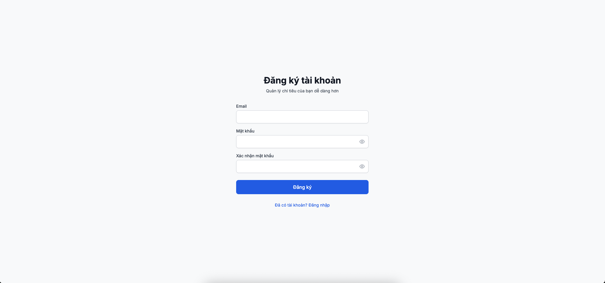
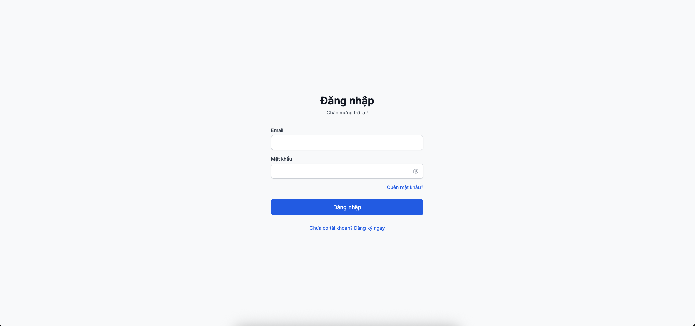
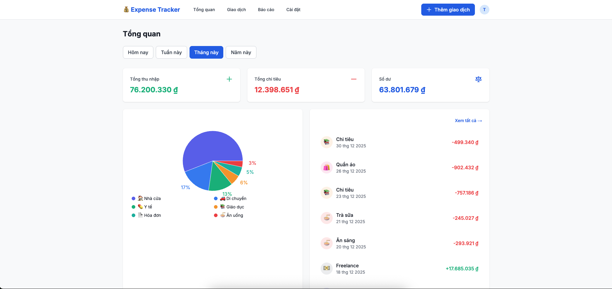
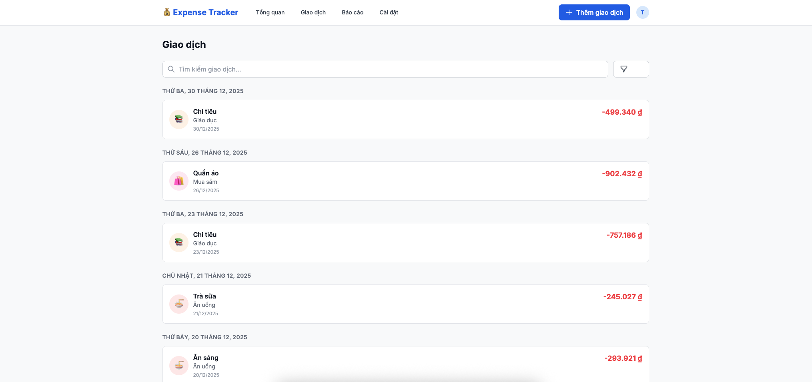
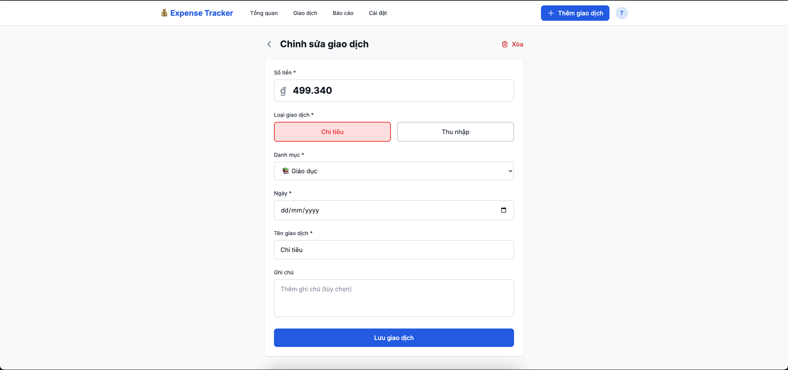
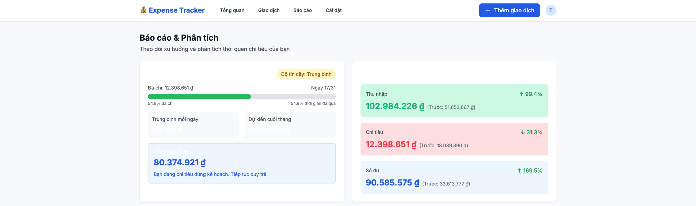
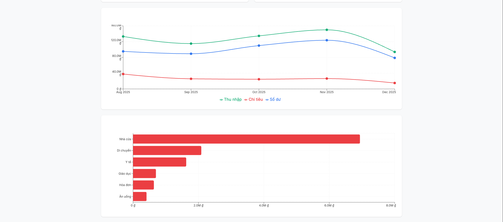
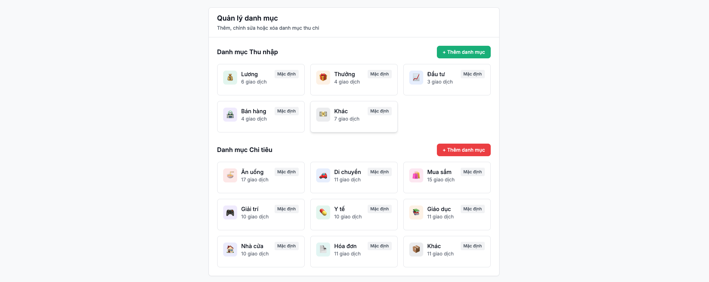
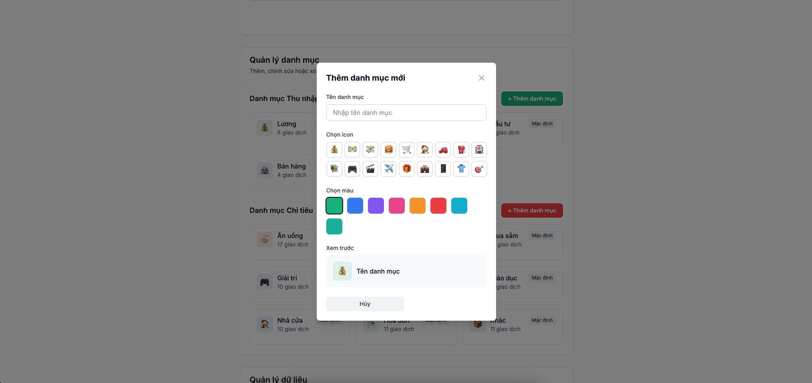
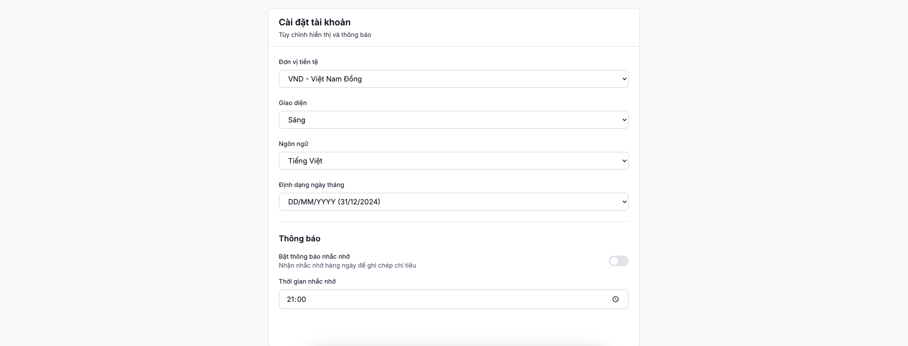

# ExpenseTracker - Hướng dẫn sử dụng

## Mục lục
1. [Giới thiệu](#giới-thiệu)
2. [Đăng ký và Đăng nhập](#đăng-ký-và-đăng-nhập)
3. [Trang chủ (Dashboard)](#trang-chủ-dashboard)
4. [Quản lý giao dịch](#quản-lý-giao-dịch)
5. [Thêm/Sửa giao dịch](#thêmsửa-giao-dịch)
6. [Báo cáo và Phân tích](#báo-cáo-và-phân-tích)
7. [Cài đặt](#cài-đặt)

---

## Giới thiệu

ExpenseTracker là ứng dụng quản lý chi tiêu cá nhân giúp bạn:
- ✅ Theo dõi thu chi hàng ngày
- ✅ Phân tích chi tiêu theo danh mục
- ✅ Xem báo cáo và biểu đồ trực quan
- ✅ Dự báo chi tiêu tương lai
- ✅ Quản lý danh mục thu chi

**Tài khoản test:**
- Email: `test@gmail.com`
- Mật khẩu: `Aa@123456`

---

## Đăng ký và Đăng nhập

### Đăng ký tài khoản mới

1. Truy cập trang đăng ký
2. Nhập email và mật khẩu (tối thiểu 8 ký tự, có chữ hoa, chữ thường và ký tự đặc biệt)
3. Xác nhận mật khẩu
4. Nhấn "Đăng ký"

### Đăng nhập

1. Nhập email và mật khẩu đã đăng ký
2. Nhấn "Đăng nhập"
3. Hệ thống sẽ chuyển bạn đến trang Dashboard

---

## Trang chủ (Dashboard)

Dashboard hiển thị tổng quan về tình hình tài chính của bạn.

### Các thành phần chính:

#### 1. Bộ lọc thời gian
- Chọn khoảng thời gian xem dữ liệu: 7 ngày, 30 ngày, 90 ngày, hoặc Tất cả
- Dữ liệu sẽ tự động cập nhật khi thay đổi bộ lọc

#### 2. Thẻ tóm tắt (Summary Cards)
- **Tổng thu nhập**: Tổng số tiền thu được trong khoảng thời gian
- **Tổng chi tiêu**: Tổng số tiền đã chi
- **Số dư**: Chênh lệch giữa thu nhập và chi tiêu
- **Số giao dịch**: Tổng số lượng giao dịch

#### 3. Biểu đồ chi tiêu theo danh mục
- Biểu đồ tròn hiển thị tỷ lệ phần trăm chi tiêu của từng danh mục
- Hover vào để xem chi tiết số tiền và phần trăm
- Chỉ hiển thị top 8 danh mục chi tiêu nhiều nhất

#### 4. Giao dịch gần đây
- Hiển thị 10 giao dịch mới nhất
- Mỗi giao dịch hiển thị: tên, ngày, danh mục, và số tiền
- Click "Xem tất cả giao dịch →" để đến trang danh sách đầy đủ

---

## Quản lý giao dịch

### Xem danh sách giao dịch

Trang "Giao dịch" hiển thị toàn bộ lịch sử thu chi của bạn.

### Bộ lọc giao dịch

1. **Tìm kiếm**: Nhập tên giao dịch để tìm kiếm
2. **Loại giao dịch**: Chọn "Tất cả", "Thu nhập", hoặc "Chi tiêu"
3. **Danh mục**: Lọc theo danh mục cụ thể
4. **Khoảng thời gian**: 
   - Chọn từ ngày đến ngày
   - Hoặc sử dụng preset: 7 ngày, 30 ngày, 90 ngày

### Phân trang

- Mỗi trang hiển thị 20 giao dịch
- Sử dụng nút "← Trang trước" và "Trang sau →" để chuyển trang
- Số trang hiện tại được hiển thị ở giữa

---

## Thêm/Sửa giao dịch

### Thêm giao dịch mới

1. Nhấn nút **"+ Thêm giao dịch"** (góc trên bên phải)
2. Điền thông tin giao dịch:
   - **Tên giao dịch**: Mô tả ngắn gọn (vd: "Mua sắm tại siêu thị")
   - **Loại**: Chọn Thu nhập hoặc Chi tiêu
   - **Danh mục**: Chọn từ danh sách có sẵn
   - **Số tiền**: Nhập số tiền (VD: 150000)
   - **Ngày**: Chọn ngày thực hiện giao dịch
   - **Thời gian**: Chọn giờ (tùy chọn)
   - **Ghi chú**: Thêm mô tả chi tiết (tùy chọn)
3. Nhấn **"Thêm giao dịch"**

### Sửa giao dịch

1. Tại danh sách giao dịch, click vào biểu tượng ✏️ bên cạnh giao dịch cần sửa
2. Cập nhật thông tin cần thiết
3. Nhấn **"Cập nhật giao dịch"**

*Chụp screenshot form sửa giao dịch và lưu vào `docs/images/edit-transaction.png`*

### Xóa giao dịch

1. Click vào biểu tượng 🗑️ bên cạnh giao dịch cần xóa
2. Xác nhận xóa trong hộp thoại
3. Giao dịch sẽ bị xóa vĩnh viễn

---

## Báo cáo và Phân tích

Trang "Báo cáo" cung cấp phân tích chi tiết về tình hình tài chính.

### Các tính năng:

#### 1. Bộ lọc thời gian
- Tùy chỉnh khoảng thời gian phân tích
- Hỗ trợ preset hoặc chọn tùy chỉnh

#### 2. Biểu đồ xu hướng chi tiêu
- Xem xu hướng thu chi theo thời gian
- Biểu đồ đường thể hiện sự thay đổi qua các tháng

#### 3. Top danh mục chi tiêu
- Danh sách các danh mục chi tiêu nhiều nhất
- Hiển thị số tiền và phần trăm so với tổng chi tiêu

#### 4. Phân tích chi tiết
- So sánh thu nhập và chi tiêu
- Tỷ lệ tiết kiệm
- Biểu đồ phân bổ chi tiêu

#### 5. Dự báo chi tiêu (Advanced Analytics)
- Dự đoán chi tiêu tháng tới dựa trên lịch sử
- Phát hiện bất thường trong chi tiêu
- Đề xuất tối ưu hóa

---

## Cài đặt

### Quản lý danh mục

Trang "Cài đặt" cho phép tùy chỉnh danh mục thu chi.

#### Thêm danh mục mới

1. Nhấn nút **"+ Thêm danh mục"**
2. Nhập thông tin:
   - **Tên danh mục**: VD: "Du lịch"
   - **Loại**: Thu nhập hoặc Chi tiêu
   - **Biểu tượng**: Chọn emoji đại diện
   - **Màu sắc**: Chọn màu cho biểu đồ
3. Nhấn **"Thêm danh mục"**

#### Sửa/Xóa danh mục

- **Sửa**: Click ✏️ để chỉnh sửa tên, icon hoặc màu
- **Xóa**: Click 🗑️ để xóa danh mục (chỉ được phép nếu chưa có giao dịch nào sử dụng)

### Thông tin tài khoản

- Xem email đăng nhập
- Thay đổi mật khẩu
- Đăng xuất

*Chụp screenshot phần account info và lưu vào `docs/images/settings-account.png`*

---

## Câu hỏi thường gặp

### 1. Làm sao để xuất dữ liệu?
Hiện tại chưa hỗ trợ xuất file. Tính năng này sẽ được bổ sung trong phiên bản tiếp theo.

### 2. Tôi có thể sử dụng offline không?
Không, ứng dụng yêu cầu kết nối internet để đồng bộ dữ liệu.

### 3. Dữ liệu của tôi có an toàn không?
Có, mọi dữ liệu được mã hóa và lưu trữ an toàn trên server. Mật khẩu được hash bằng bcrypt.

### 4. Làm sao để xóa tài khoản?
Liên hệ admin qua email để yêu cầu xóa tài khoản.

---
